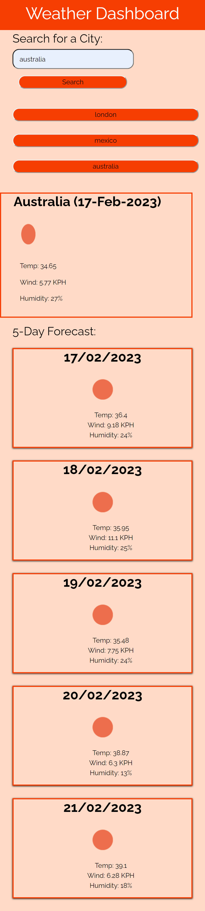
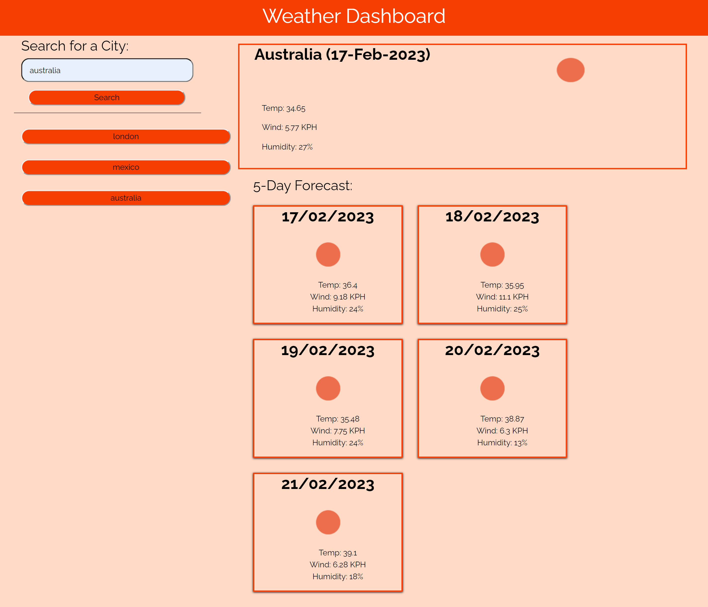

# Weather_Dashboard

## Description 

This is a weather app which allows users to get the current weather as well the forecast of a city they chosen. 
The app will users plan for their accordingly for the weather and will aslo provide information for those who are just curious about the weather forecast in a certain city.

The app uses the openweather API to get its data and provides a user friendly interface to display it.

## Installation/Access
The app  has been deployed on GitHub pages and can be accessed via this link:  
https://dumisilem.github.io/Weather_Dashboard

## Usage 
To use the weather app, simply type the name of the city you want to search for and click search. You will then be presented with current weather as well as 5-day forecast of the weather in that city. 

Your past searches are saved as you search and you can click on the the buttons view weather for that city again.

For reference, this is what the website should look like:  

## Credits
N/A

## License
N/A
